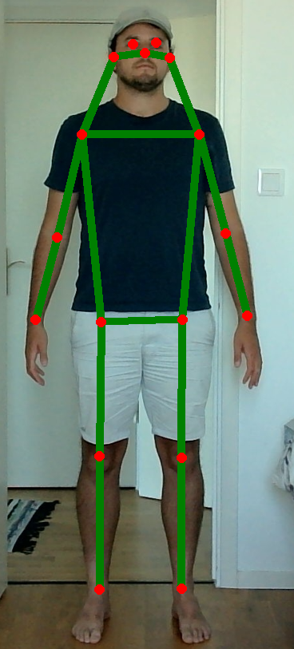

## [Auto.exe](Dist/Auto.exe)

This tool automates human pose annotation in videos using the [YOLOv8](https://github.com/ultralytics/ultralytics) model, trained for 2D pose estimation on the MS COCO dataset. Run on a Windows machine as administrator.

### Key features:

- **Set start and end time**: Define the video segment to be processed by specifying the start and end times (in seconds).
- **Open video**: Load a video file for pose estimation and annotation.
- **Automatic pose detection**: Detects and annotates human poses using the YOLOv8 pose estimator.
- **Keypoint connections**: Visualise pose connections for keypoints.
- **Progress tracking**: Displays a progress bar while processing video frames.
- **Save annotated frames**: Saves the annotated frames and keypoint data in a designated output folder.

### Outputs:
- **Annotated frames**: Saves each frame as both a raw and annotated image.
- **Keypoint data**: Saves the detected keypoints for each frame in a text file (`.txt`) with the coordinates of key body parts.

### GUI

  
   
  <i>The GUI of the Auto.exe application.</i>

## [Semi-auto.exe](Dist/Semi-auto.exe)

This tool assists with semi-automatic human pose annotation in images using the YOLOv8 model for keypoint detection. Users can refine the automatically detected keypoints by dragging them to the correct locations. Run on a Windows machine as administrator. Video demo available here: [VideoDemo_x175.mp4](Demo/VideoDemo_x175.mp4). 

### Key features:

- **Open image**: Load an image for pose annotation.
- **Automatic keypoint detection**: Automatically detects human pose keypoints using the YOLOv8 pose estimator.
- **Manual keypoint adjustment**: Allows users to click and drag keypoints to correct their position.
- **Save annotations**: Save the adjusted keypoints to the corresponding `.txt` file.
- **Save annotated images**: Save the image with visualised keypoints and skeletal connections.

### Outputs:
- **Annotated keypoints**: Saves the manually adjusted keypoints for each body part to the corresponding `.txt` file.
- **Annotated images**: Saves two versions of the image, one with keypoints and another with skeletal connections.

### GUI

  
   
  <i>The GUI of the Semi-auto.exe application.</i>

## [Manual.exe](Dist/Manual.exe)

This tool allows for fully manual annotation of human pose keypoints in images. Users manually select each keypoint. Run on a Windows machine as administrator.

### Key features:

- **Open image**: Load an image for manual pose annotation.
- **Manual keypoint annotation**: Users click to place keypoints on the image.
- **Keypoint visualisation**: Displays each keypoint as it is annotated, with labels showing the body part.
- **Undo annotation**: Right-click to undo the last annotated keypoint.
- **Save annotations**: Save the manually annotated keypoints to a corresponding `.txt` file.
- **Save annotated images**: Save the image with visualised keypoints and skeletal connections.

### Outputs:
- **Annotated keypoints**: Saves the manually selected keypoints for each body part to a corresponding `.txt` file.
- **Annotated images**: Saves two versions of the image, one with keypoints and skeletal connections and another with just skeletal connections.

### GUI

  
   
  <i>The GUI of the Manual.exe application.</i>

## MS COCO pose format

## Contributing
Feel free to submit pull requests or open issues for improvements or bug fixes!

### To Do:
- [ ] Adapt to output commonly used 2D pose formats.
- [ ] Outut confidence scores.
- [ ] Custom pose tool.
- [ ] Ensure annotated images are saved in the same format accross all 2D pose tools.
- [ ] Ensure 'results' outputs are always saved in a consistent manner accross all tools, e.g. in the manual editor, the file name saves differently to the semi auto and automatic annotator.
- [ ] Allow for dragging keypoints in the manual annotator once they’re plotted (currently the points are locked in place once plotted).
- [ ] Fix threading issue.
