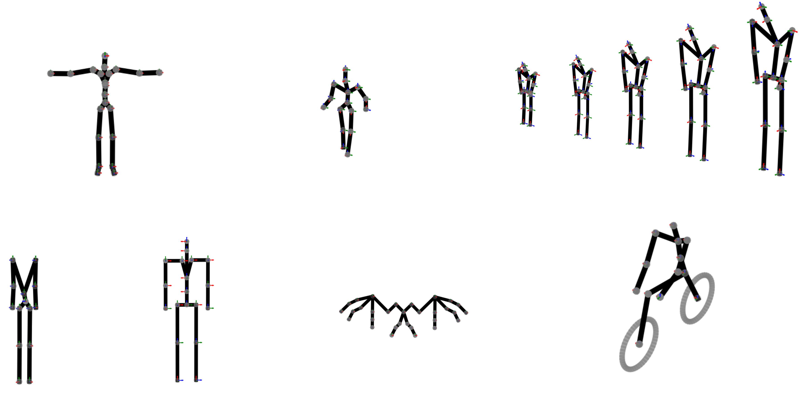

## [KinePose.exe](Dist/KinePose.exe)

This tool performs 6DOF inverse kinematics (IK) analysis on human pose data using 3D keypoints and a user-defined kinematic chain. It includes options for both frame-by-frame and temporal optimisations, with features to load and process kinematic chain data, keypoints, and motion visualisations. Run on a Windows machine as administrator

### Key features:

- **Load Kinematic Chain**: Load the kinematic chain (in Excel format) for the human body model (HBM), defining joint orientations and positions.
- **Load 3D Keypoints**: Load 3D pose keypoints (in `.txt` format) from the HBM.
- **Inverse Kinematics**: Perform frame-based or temporal IK optimisation to align the kinematic chain with the loaded 3D pose keypoints.
- **Manual Repositioning**: Optionally perform manual joint repositioning in the initial frame for greater precision.
- **Motion Smoothing**: Apply the Savitzky-Golay filter to smooth IK results across frames.
- **Visualisation**: Visualise both the kinematic chain and the pose data, with options to display animations using a slider.
- **Save Results**: Save the transformation data (local/global orientations, positions, and angular velocities) to Excel files for further analysis.

Video demo available here: [VideoDemo_x175.mp4](Demo/VideoDemo_x175.mp4).

### Outputs:
- **Transformation Data**: Saves local and global joint orientations and positions in `.xlsx` files.
- **Angular Velocities**: Saves angular velocities for each joint in `.xlsx` format.

## To Do:
1. 
