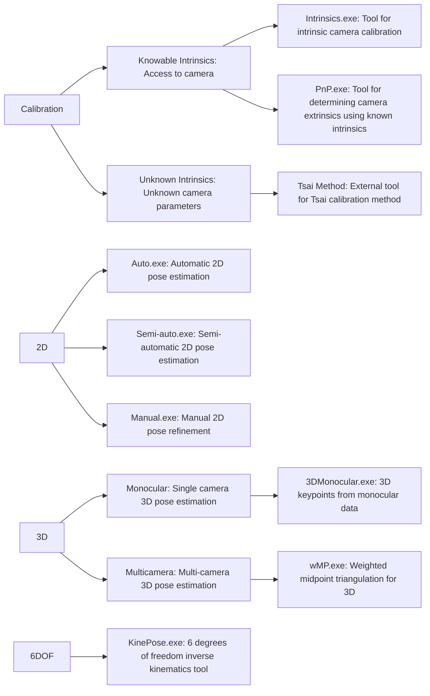

# KinePose

The KinePose framework employs a modular suite of computer vision (CV) and inverse kinematics (IK) techniques to track human body motions from image/video data.


### Computer Vision Techniques
The initial step is 2D human pose estimation (2DHPE), employing a deep learning (DL) model trained on annotated image data, which localises body keypoints in pixel-space; [YOLOv8](https://github.com/ultralytics/ultralytics) trained on the MS COCO dataset is currently implemented in the pipeline. Optional manual refinement tools are also provided for enhanced accuracy. 

For monocular data, 3D human pose estimation (3DHPE) can subsequently be achieved through a DL model trained on motion capture data; [MotionBert](https://github.com/Walter0807/MotionBERT) trained on the H3.6M dataset is currently implemented in the pipeline. For multi-camera data, we have devised a weighted midpoint method (wMP) to triangulate 2D coordinates into 3D while weighting the solution by individual 2D keypoint confidence scores.

### Inverse Kinematics Algorithms
The IK system allows for a fully user-defined kinematic chain, accommodating various joint numbers, placements, configurations, degrees of freedom (DOFs), and ranges of motion (ROMs) as Euler/Cardan angle ranges from the rest pose for HBM-specific results.

Furthermore, specific pose and temporal loss terms, weights, and temporal patch lengths can be tailored to the needs of the analysis. See reference [https://doi.org/10.56541/QTUV2945](https://arxiv.org/pdf/2207.12841), with supplementary material ([Supp. Mat.](https://kevgildea.github.io/assets/docs/KinePose/SuppMat.pdf)) for details on the algorithms. The outputs are joint orientations in both global and local coordinate systems, and angular velocities, with optional Savitzky-Golay filtering to reduce noise while preserving key motion features.


## Flowchart




## Citations
```
@inproceedings{Gildea22,
    author    = {Gildea, Kevin and Mercadal-Baudart, Clara and Blythman, Richard and Smolic, Aljosa and Simms, Ciaran},
    title     = {KinePose: A temporally optimized inverse kinematics technique for 6DOF human pose estimation with biomechanical constraints},
    booktitle = {Irish Machine Vision and Image Processing Conference (IMVIP)},
    year      = {2022},
    doi       = {10.56541/QTUV2945}
}
@inproceedings{Gildea24,
    author    = {Gildea, Kevin and Simms, Ciaran},
    title     = {KinePose Framework for Computer Vision‐Aided Reconstruction of Pose and Motion in Human Body Models},
    booktitle = {International Research Council on Biomechanics of Injury (IRCOBI)},
    year      = {2024}
}
@inproceedings{Gildea24b,
    author    = {Gildea, Kevin and Hall, Daniel and Simms, Ciaran},
    title     = {Forward dynamics computational modelling of a cyclist fall with the inclusion of protective response using deep learning-based human pose estimation},
    booktitle = {Journal of Biomechanics},
    year      = {2024},
    doi       = {10.1016/j.jbiomech.2024.111959}
}
```


## Funding

<a href="https://www.saferresearch.com/projects/advancements-kinepose-framework">
  
</a>

<br>

<a href="https://portal.research.lu.se/en/projects/surrogate-measures-of-safety-for-single-bicycle-crashes">
  
</a>
